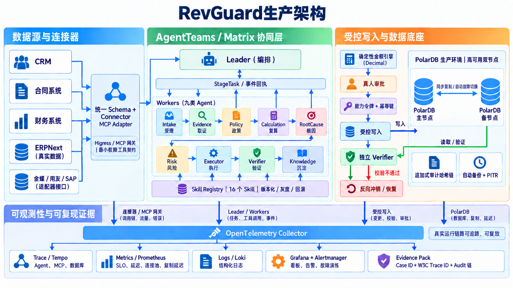

# RevGuard — 面向企业渠道佣金结算异常的多智能体治理平台

RevGuard 把渠道佣金异常处理做成一条可复核的协作流程：取证、规则匹配、金额复算、风险判断、人工审批、受控写入和独立验证都有明确的状态和证据。

## 先看懂几个词

| 术语 | 本项目中的含义 |
|---|---|
| 渠道伙伴 | 代理商、经销商、门店或服务商等企业外部销售合作方。 |
| 佣金 | 企业根据销售、回款或激励规则支付给渠道伙伴的提成。 |
| 政策 / 政策版本 | 规定佣金比例、适用条件和生效时间的规则；同一政策可能随季度或日期变化。 |
| 等级 | 渠道伙伴的合作级别，例如 GOLD、SILVER；等级会影响佣金比例，但必须按订单发生时点判断。 |
| 证据 | 支撑“这笔佣金是否正确、应该是多少”的订单、合同、回款、退款和审批记录。 |
| 案件 | 一次需要调查、判断、处理和验证的佣金或结算异常。 |
| Skill | 一个有固定输入、输出和权限边界、可由多个 Agent 复用的任务能力。 |
| MCP | Agent 与 Skill 之间的标准协议层；本项目按 Worker 隔离可见 Skill，并要求绑定 StageTask。 |
| Adapter | 连接 Agent 与 CRM、财务、工单等外部系统的适配层；它负责传递请求，不负责替代业务规则。 |

## 演示与官网

[项目官网](https://ld0574.github.io/revguard/) · [运行回放](https://ld0574.github.io/revguard/replay.html) · [B 站演示视频](https://www.bilibili.com/video/BV1fhtS6GE2y/)

运行回放由 `scripts/export_case_replay.py` 从运行记录导出，页面只展示脱敏后的案件、Trace 和审计证据。

## 场景背景

企业通常通过代理商、经销商和服务商销售产品，再按照订单、回款、合作等级和阶段政策，
向渠道伙伴支付佣金（销售提成）。一笔结算可能同时受政策版本、订单时间、回款状态、
退款和激励条款影响；相关数据又分散在 CRM、合同、财务、佣金和工单系统中。
因此，少算、多算、漏算或错用规则不仅难以及时发现，还会直接形成资金损失和对账争议。

RevGuard 将这类异常处理做成一条可复核的协作流程：从受理问题开始，收集相关证据，
找出正确规则，重新计算金额，说明差异原因，判断风险，经过审批后执行，并在执行后独立验证。
它不是只给出一个答案，而是把“为什么这样算、谁可以批准、实际改了什么、结果是否恢复”
都留下可追溯记录。

## RevGuard 生产架构



架构按企业内网生产环境组织：CRM、合同系统和财务系统提供合成业务数据，ERPNext 提供真实数据接口，
金蝶 / 用友 / SAP 通过适配器接口接入。Leader 通过 AgentTeams / Matrix 派发九类 Agent，
StageTask、Skill Registry、Higress / MCP 网关、审批、受控写入和独立验证共同组成业务闭环。
写入走 PolarDB 主节点，读取与验证走备节点；Trace、Metrics、Logs、Grafana、Alertmanager
和 Evidence Pack 统一沉淀可观测证据。

## 系统边界

当前 Demo 把“理解问题”和“动用资金”明确分开：案件解析、政策匹配、金额计算、差异解释、
风险分级、权限和状态流转均由可重复的确定性代码完成。AgentTeams Worker 使用语言模型
理解并执行被绑定的 StageTask，但模型不能自行推进案件状态、计算金额或直接写资金台账；
实际业务结果仍由服务端确定性 Skill 与权限边界裁决。

## 四重约束：Agent 不能绕过的四道边界

架构总纲一句话：**确定性控制面与 LLM 语义面强制切分**——金额、政策版本、权限、状态迁移与
资金执行全部由确定性代码决定；模型只负责理解、检索、解释与协作。下面四重约束是这句总纲的落点。

这四重约束是项目自身的安全设计归纳，每一重都对应服务端机制和可复核证据：

| 约束 | 代码机制 | 可复核证据 |
|---|---|---|
| **任务不漂移** | 状态迁移白名单、Skill/状态绑定、case version 快照和 StageTask 约束任务范围。 | 非法迁移测试、旧任务失效测试、`STATE_TRANSITION` 审计事件。 |
| **审批不自签** | 带外 Matrix 账号验证、绑定案件/审批单/决定的 120 秒身份证明；拒绝静态审批 key；L2 短时执行能力、L3 禁止自动执行。 | 人类 subject/认证时间审计、跨案件/动作拒绝测试及回滚案例。 |
| **额度不外溢** | 案件、币种、总额和逐组件额度绑定；幂等键防重复写入；冲销令牌一次性使用。 | 跨组件额度、并发双写和令牌重放安全探针。 |
| **权限不升级** | Bearer 请求映射为服务端 Principal；每个 Skill 有 actor 白名单和最小 scope；响应与 Trace 脱敏。 | 401/403/422 边界测试和嵌套字符串脱敏测试。 |

风险分级回答“这笔异常最多允许处理到哪一步”，四重约束回答“Agent 为什么不能绕过这一步”。

在这四重约束之上还有一层**可复算的工程约束**：16 个 Skill 各带 manifest / instruction /
callable 三级 SHA-256 摘要，基线固定在 `config/skill-integrity.json`；API 与 MCP 进程启动时校验，
不一致即拒绝启动，每次 Skill 调用把三级摘要写入 `SKILL_INVOKED` 审计事件。详见
[`docs/skill-integrity.md`](docs/skill-integrity.md)。

## 已验证能力

- Leader 加九类 Agent，Executor 负责受控写入，Verifier 独立复核；每个 Worker 只能调用被授权的 Skill。
- 16 个版本化 Skill 都有 manifest、输入/输出、身份和失败处理约束，加载时校验摘要，调用时写入审计。
- StageTask 绑定案件版本、Skill、Worker 身份和输入快照；状态变化、错 Worker、改动输入和任务重放都会被拒绝。
- L0 只读，L1 只创建不生效的草稿，L2 经过真人审批后写入，L3 只给出方案；金额由 Decimal 确定性引擎计算。
- 写入后由独立 Verifier 复核；结果错误时执行反向冲销，结果未知时冻结通道并按原操作 ID 对账。
- PolarDB 使用 `NUMERIC(18,2)`、追加式审计哈希链、主节点写入和备节点读取/验证；复制延迟或主节点异常时按策略切回。
- OpenTelemetry、Tempo、Prometheus、Loki、Grafana、Alertmanager 和 Evidence Pack 贯穿连接器、Agent、数据库和恢复流程。
- CRM、合同和财务输入是合成业务数据；ERPNext 是已验证的只读企业 Provider；金蝶、用友和 SAP 的连接状态为“待验证”。

数据来源边界见 [`docs/data-provenance.md`](docs/data-provenance.md)，适配器状态见 [`docs/adapters.md`](docs/adapters.md)，
运行证据和安全边界见 [`docs/EVIDENCE_HONESTY.md`](docs/EVIDENCE_HONESTY.md)。

## 核心链路

```text
案件受理 → 实体解析 → 并行取证 → 按业务时点匹配政策 → 精确金额复算
       → 解释差异原因 → 风险分级 → 人工审批 → 受控写入
       → 独立验证 ─失败→ 反向冲销 → 再次验证
       → Trace / 报告 / Dataset 沉淀
```

其中，Trace 是每一步处理的时间线记录，Audit 是面向审计的关键操作记录，Dataset 是可用于
复盘和评测的案例数据；三者共同回答“系统做了什么、依据是什么、结果能否重放”。

## 在企业内网生产环境运行

所有构建、测试与服务均在 `10.10.10.202` 的 Docker 中执行，本地只编辑和同步文件。
部署、迁移、播种和健康检查统一使用 [`scripts/deploy_demo.sh`](scripts/deploy_demo.sh)：

```bash
# SQLite + WebUI，适合快速查看完整链路
bash scripts/deploy_demo.sh --local

# AgentTeams + PolarDB + 可观测性
bash scripts/deploy_demo.sh --full --model glm-5.3-flash

# 隔离发布验证，不挂载生产卷
bash scripts/verify_docker.sh
```

`--local` 未配置 Matrix 身份时会停在人审节点；生产环境的 API key、签名密钥和 ERPNext 凭据只放在权限为 `0600` 的私有环境文件中。
完整部署约束和故障恢复步骤见 [`docs/deployment.md`](docs/deployment.md)。

运行产物主要包括：

- `docs/reports/CASE-*.md`：案件证据、审批、执行、回滚和审计报告；
- `data/outputs/traces/CASE-*.json`：Agent、Skill、Tool、审批和执行 Trace；
- `docs/evaluation-summary.json`：评测环境、指标和样本的发布快照。

## API 与身份边界

API 默认 fail-closed：除健康检查外，端点都要求 Bearer 身份；角色、scope、案件状态和
StageTask 绑定由服务端校验，请求体不能自行声明 actor 或权限。生产环境至少配置签名密钥、
API key 到 Principal 的映射，并关闭不安全的演示身份。

完整端点、请求示例、角色权限、环境变量和 OpenAPI 说明统一见 [`docs/api.md`](docs/api.md)。
PolarDB 迁移与主备读写路由见 [`docs/polardb-production.md`](docs/polardb-production.md)，
发布与运维见 [`docs/operations.md`](docs/operations.md)。

## Docker Compose

日常只需要四个入口。统一脚本会自动拼接底层 Compose 文件；以下命令均在企业内网生产环境（10.10.10.202）执行。

| 场景 | 入口 | 适用范围 |
|---|---|---|
| 本地演示 | `local` | SQLite、MCP 参考链路和 WebUI |
| 生产基础栈 | `production` | AgentTeams、PolarDB 和完整可观测性 |
| 企业 ERP 接入 | `enterprise` | 生产基础栈加 ERPNext 只读适配器 |
| 发布验证 | `verify` | 隔离 PostgreSQL、后端测试和前端门禁 |

### 常用命令

```bash
# 本地演示
bash scripts/compose_profile.sh local up -d --build

# 企业内网生产基础栈
bash scripts/compose_profile.sh production up -d --build

# 企业 ERPNext 只读接入（凭据只放在权限为 0600 的私有 env 文件）
bash scripts/compose_profile.sh enterprise up -d --build

# 查看生产基础栈
bash scripts/compose_profile.sh production ps

# 发布门禁（自动使用隔离 Compose 项目）
bash scripts/verify_docker.sh
```

文件分组如下：

- **基础服务**：`docker-compose.yml`；只定义 RevGuard API 和演示持久化卷。
- **生产覆盖层**：`docker-compose.agentteams.yml`、`docker-compose.polardb.yml`、
  `docker-compose.observability.yml`、`docker-compose.enterprise.yml`；分别接入 AgentTeams、PolarDB、
  可观测性后端和 ERPNext 企业网络。
- **发布门禁**：`docker-compose.verify.yml`；使用临时数据库和独立 Compose 项目，不挂载生产卷。

需要单独启动 ERPNext 作为数据源时，使用 `docker-compose.erpnext.yml`，具体准备步骤见
[`docs/deployment.md`](docs/deployment.md)。

容器使用非 root 用户、只读根文件系统、无 Linux capabilities、资源限制和健康检查。
`REVGUARD_RESET_ON_START=true` 只用于隔离演示重置；企业内网生产环境默认保留案件和审计状态。

## 目录结构

```text
revguard/
├── revguard/
│   ├── security.py       # RBAC、API Principal、签名能力令牌
│   ├── skill_runtime.py  # 16 个 Skill 的版本化运行时
│   ├── skills.py         # Skill 实现与注册中心
│   ├── skill_schemas.py  # 16 个 Skill 的 JSON Schema 单一事实源
│   ├── agent_bridge.py   # StageTask/StageResult 与 case version 绑定
│   ├── mcp_server.py     # 每 Worker 隔离、任务绑定的 MCP Skill Server
│   ├── mcp_team.py       # 状态驱动 MCP Team 可执行参考编排
│   ├── state_machine.py  # 状态迁移白名单与终态不变量
│   ├── orchestrator.py   # 阶段编排、审批、执行、验证与回滚
│   ├── rule_engine.py    # Decimal 确定性规则引擎
│   ├── policy_matcher.py # 严格日期解析与政策 Time Travel
│   ├── store.py          # 本地 SQLite Store + 存储工厂
│   ├── postgres_store.py # PostgreSQL/PolarDB 主/只读连接池适配
│   ├── trace.py          # 可回放 Trace
│   └── api.py            # FastAPI 服务
├── agentteams/           # Worker SOUL、MCP Host 示例与 REST 兼容 Adapter
├── data/golden_cases/    # 8 个端到端场景
├── migrations/polardb/  # 核心 Schema 与可选 pgvector 迁移
├── docs/                 # API、Agent、PolarDB、运维、评测与报告
├── website/              # GitHub Pages 官网与运行回放页（纯静态）
├── scripts/              # seed、demo、evaluation、回放导出、AgentTeams setup、Compose profile 入口
└── tests/                # 自动化测试（含需一次性 PostgreSQL 的条件测试）
```

## MCP 与 RAG 边界

完整部署使用 Higress REST-to-MCP：9 个独立 Server 分别授权给对应 Worker consumer，
后端 key 不下发给职能 Worker。每次调用必须绑定不可漂移的 StageTask；本地 stdio
Server 仅作为参考测试。配置与验证见 [`agentteams/mcp/README.md`](agentteams/mcp/README.md)。
MCP 与 REST 共用同一套 Schema、执行器、状态机、权限、StageResult 事务与 Audit。详见
[`docs/adr/0007-scoped-mcp-skill-transport.md`](docs/adr/0007-scoped-mcp-skill-transport.md)。

金额与政策判断依赖精确业务事实，当前不采用语义检索；上下文由 Shared Case State、
Case Memory 与 Trace 三层承载。只在自然语言政策规模和离线 recall@k 证明收益后考虑 RAG。

## 开源状态

本项目已作为公开仓库发布，采用 Apache-2.0 LICENSE。依赖/许可证边界、OpenAPI、架构决策、
Docker 验证入口和发布材料均已纳入仓库。见 [`LICENSE`](LICENSE)、
[`docs/dependencies.md`](docs/dependencies.md) 与 [`docs/adr/`](docs/adr/README.md)。

公开地址：<https://github.com/ld0574/revguard>。
