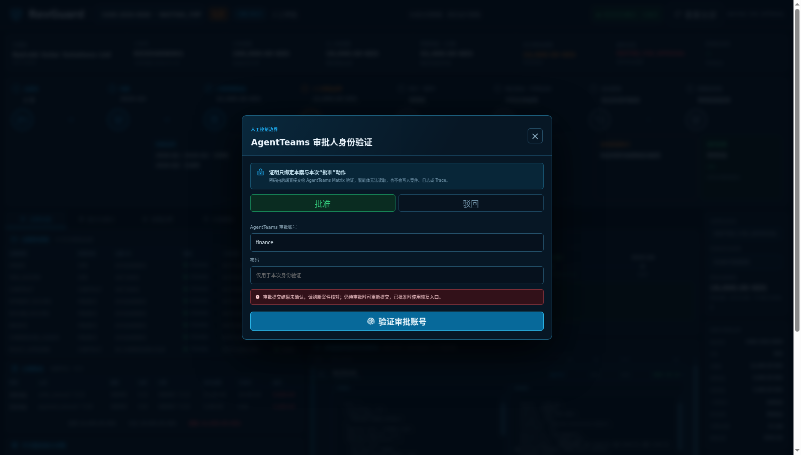
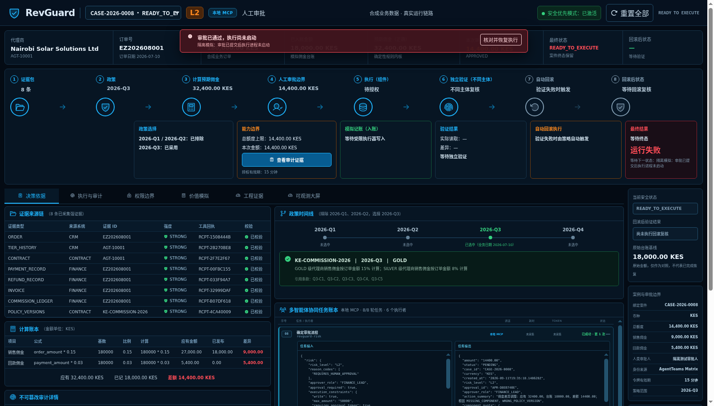

# 人审与状态一致性验收（2026-09-12）

RevGuard 0.5.5 已部署至 10.10.10.202 Docker。本轮修正人工审批、状态迁移和审批后执行交接的一致性；所有构建、测试、服务、故障和浏览器验证均在 202 的 Docker 容器内执行。

| 已复现的问题 | 修正及验证 |
| --- | --- |
| 人审决定先保存，案件进入执行态失败后仍停在人审节点，重试又被拒绝 | 审批网关、审批投影、人审审计、案件迁移和执行排队在同一数据库事务提交；SQLite/PG 触发器拒绝案件写入时，全部回滚，修复故障后可正常审批 |
| 状态写入失败后，调用者内存和审计已声称迁移成功 | 状态及审计一次提交，提交成功后才更新调用者对象；写入失败、末尾审计失败均保留原状 |
| 并发或迟到的状态迁移可覆盖新状态 | 主库行锁下比较状态、录制批次和状态代次；即使案件经过恢复再次回到同名状态，旧回调也被拒绝；保留调用者在当前阶段准备的业务字段 |
| 驳回与任务取消分开提交 | 驳回、开放任务取消和审计同一事务；拒绝案件写入时任务保持原状，成功时取消且不产生资金执行 |
| 已批准但 API 进程未成功启动执行，READY_TO_EXECUTE 无法恢复 | 持久化执行交接，增加该状态的恢复路径；新鲜队列仍禁止重复调度，已确认的启动失败可由人审立即恢复，过期队列经重新授权后恢复；不跳过 PermissionCheckSkill |
| MCP 参考执行结束仍可能残留排队标记 | 完成后保存 COMPLETED 和实际任务数量；测试确认录制互斥检查不再被残留标记阻塞 |

`reproduced.log` 保存原版 4 项失败（SQLite/PG 各两项）。`release.log` 和 `release-exit.txt` 记录最终发布检查：241 项唯一测试覆盖，其中主套件 195 项通过、46 项 PostgreSQL 测试单独全部通过，覆盖率显示 **91%**；确定性评测 105/105。Ruff、生成契约检查、pip-audit、Bandit 通过；前端重新构建，12 项测试通过，npm 审计为 0。

浏览器通过真实 RevGuard API 和 MCP 参考链执行三种场景：数据库拒绝审批写入后显示明确错误，审批仍为 PENDING、无资金写入；解除故障后审批闭环；模拟已提交审批的执行交接丢失后，从页面“核对并恢复执行”完成人审并恢复。两条成功路径均完成 16 个实际 MCP StageTask、两条执行记录，最终 CLOSED，队列 COMPLETED。390 像素宽度无外层横向溢出，除预期 503 外无严重浏览器错误。

**身份边界：**浏览器身份服务是隔离 Matrix HTTP 契约夹具，使用公开的测试账号；该结果验证 UI、后端动作证明与执行链，不冒充本轮重新验证了生产 AgentTeams 账号或真实企业审批。`browser-probe.py`、`identity-fixture.py`、`isolated-preview-setup.py` 保存复验代码，后两者只能用于一次性隔离环境。

生产只更新 API 镜像。`deployment-before.json` 和 `deployment-after.json` 的原 8 个案件、每案执行记录、9 条 ledger 和 261 行有效审计链完全一致。Grafana 仍以同源只读 iframe 嵌入，12 个不同面板查询均为 HTTP 200，全屏和移动宽度通过，4 个 Prometheus 目标全部 up。

实际发布镜像的 Trivy Debian/Python 扫描使用 `--ignore-unfixed`，可修复 HIGH/CRITICAL 为 0，`production-image-id.txt` 与扫描 ImageID 一致；这不是宿主机、其他组件或全部严重级别的扫描结论。

状态代次保护迁移，不代表普通案件字段和 Matrix 进度更新已经全部具备乐观并发检查。StageTask 快照与领取、恢复流程其他写入、完整冷部署、其他 UI 状态和答辩材料继续列在整项目复核清单。审批事务仅覆盖自有适配器与数据库，不代表外部 ERP/审批系统的分布式事务，也不代表云 HA/PITR。`acceptance.json` 明确标记整项目复核尚未结束。

