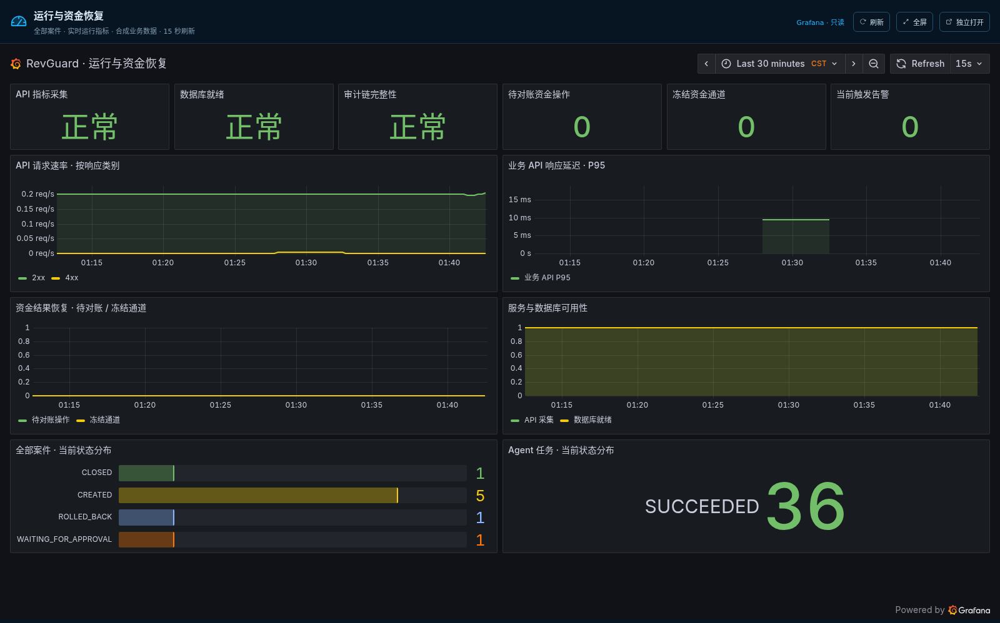

# Grafana 内嵌大屏验收（2026-09-12）

RevGuard 0.5.1 已部署至 10.10.10.202 Docker。入口：[demo-ui 可观测大屏](http://10.10.10.202:19000/demo/?view=observability)。本次全部构建、测试、Chromium 浏览器及隔离故障检查均在 202 容器执行；本地仅编辑、检查文件、同步与 Git 操作。

## 验收结果

| 检查 | 结果 | 证据 |
| --- | --- | --- |
| 正式 iframe | 12 个不同面板的查询全部 HTTP 200，无浏览器错误或失败请求 | production/browser-result.json |
| 大屏布局 | 1600×1050 全屏通过；390×844 外层页面无横向溢出 | production/grafana-fullscreen.png、production/grafana-mobile.png |
| 实时监控 | Grafana 12.1.1 正常，Prometheus 4 个采集目标全部 up | production-health.json |
| 只读边界 | 管理员、登录、数据源代理与任意查询拒绝；状态接口要求 viewer | production-health.json、embed-tests.log |
| 隔离 Grafana 暂停 | iframe 隐藏，显示不可用及重连提示；检查结束后 unpause | browser-unavailable.json、grafana-unavailable.png |
| 后端回归 | 3 项代理边界、26 项既有 API 测试通过；Ruff、Bandit 通过 | embed-tests.log、api-tests.log |
| 前端 | 构建通过，8 项 UI 与 4 项 Sites 测试通过 | frontend-build.log、frontend-tests.log |
| 演示数据 | 原 8 个案件、执行记录、9 条 ledger 和 261 行审计链前后完全一致 | deployment-before.json、deployment-after.json |

生产浏览器直接访问宿主机 19000 入口，验证真实的同源 iframe、自动刷新、全屏及移动宽度。截图中的业务案件是合成演示数据，图表为实际 Prometheus 采集；这次没有执行或重置业务案件。只暂停独立的 `revguard-grafana-preview`，未停止生产 Grafana 或生产数据库。

## 访问与复现

`browser-probe.py` 是本次使用的 Selenium 脚本，在 202 的 `revguard-grafana-browser:20260912` 容器执行。该浏览器镜像含 Chromium、匹配的驱动、Selenium 及中文字体。设置 `DEMO_URL` 为正式入口、`CHECK_LAYOUT=true`，挂载脚本到 `/probe.py`、证据目录到 `/evidence`，使用 `--entrypoint python` 运行。`EXPECT_UNAVAILABLE=true` 仅用于独立预览停机检查，不能对生产组件注入故障。

`health-probe.py` 在 202 Docker 网络中验证服务与路径边界，metrics 凭证从只读运行目录读取。输出中的共享看板标识已经替换为 `<dashboard>`；管理员凭证和部署配置不进入本目录。`source-sha256.json` 固定已部署的相关源文件，`SHA256SUMS` 覆盖此证据包。

当前嵌入展示运行指标与资金恢复状态；日志和 Trace 的后端验收见先前的 `finals-acceptance-20260912`，本次没有把通用日志/Trace 检索开放给共享看板。共享链接的持有者可读所选看板；同源代理不提供 Grafana 管理会话。

