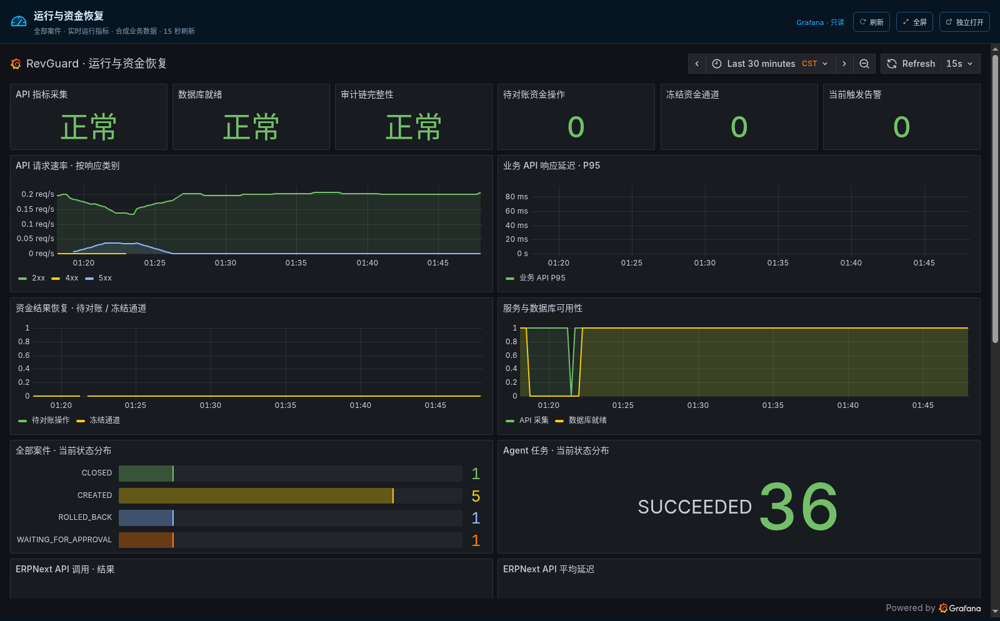

# Grafana 内嵌大屏验收（2026-09-18，23 面板）

Demo UI 通过同源代理 `/grafana/` 嵌入 Grafana 只读共享看板，本次在 10.10.10.202 Docker 内完成构建、浏览器检查与静态预览；本地只编辑文件、同步与 Git 操作。

## 验收结果

| 检查 | 演示栈 19088 | 常驻栈 19000 |
| --- | --- | --- |
| iframe 数量与同源地址 | 1 个（`/grafana/public-dashboards/<dashboard>`） | 1 个 |
| 面板查询覆盖 | 23/23 面板全部 HTTP 200 | 23/23 |
| 全屏 | 通过（`document.fullscreenElement` 为真） | 通过 |
| 移动端 390×844 | 外层无横向溢出 | 外层无横向溢出 |
| 失败请求 / 浏览器错误 | 0 / 0 | 0 / 0 |

Prometheus 4 个采集目标全部 `up`：`otel-collector`、`prometheus`、`readiness`、`revguard`（见 observability-endpoints.json）。两个栈的 `/api/v1/ops/observability` 均返回 `enabled=true`，复用同一块只读共享看板，不复制管理员凭据。

演示栈入口：`http://10.10.10.202:19088/demo/?view=observability`
常驻栈入口：`http://10.10.10.202:19000/demo/?view=observability`

## 本次修复的两个问题

1. **演示栈此前没有嵌入 Grafana**：`revguard-api-dev` 容器创建于 `docker-compose.finals.yml` 增加 Grafana 覆盖之前，缺少 token 挂载与 `observability` 网络。用
   `docker compose -f docker-compose.dev.yml -f docker-compose.finals.yml -p revguard-dev up -d revguard-api-dev`
   重建后，`/api/v1/ops/observability` 由 `enabled=false` 变为 `enabled=true`。
2. **浏览器探针此前只统计到首屏面板**：Grafana 只在面板进入视口时才发起查询，旧探针因此只看到 14/23 个面板并误判失败。探针现在会在 iframe 内滚动一遍，确保 23 个面板全部被请求后断言。

## 复现方式

```bash
docker run --rm \
  -v <evidence>/browser-probe.py:/probe.py:ro -v <out>:/evidence \
  -e DEMO_URL="http://10.10.10.202:19088/demo/?view=observability" \
  -e CHECK_LAYOUT=true -e EXPECTED_PANELS=23 \
  --entrypoint sh revguard-grafana-browser:20260918 \
  -c "ln -sf /usr/bin/chromedriver /app/chromedriver && python /probe.py"
```

浏览器镜像由 `python:3.12-slim` + `chromium`/`chromium-driver` + `selenium` + 中文字体构建（含 `curl`，便于同时运行 `scripts/rehearsal_smoke.sh`）。探针输出中的共享看板标识替换为 `<dashboard>`，不写入管理员凭据。

同一次会话的演示栈冒烟结果为 **6 PASS / 0 FAIL**（双案例终态、ERPNext 证据来源、真人身份验证跨度均通过），现场 Demo 通路可用。


