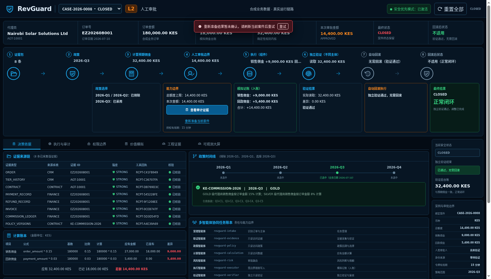
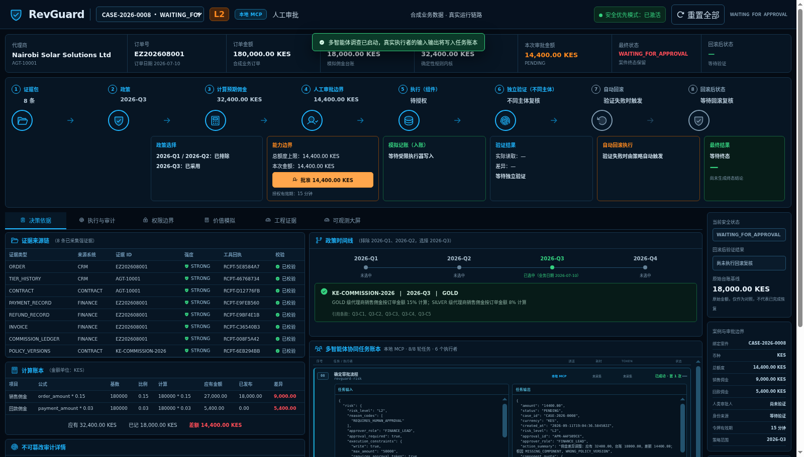

# 录制一致性验收（2026-09-12）

RevGuard 0.5.4 已部署至 10.10.10.202 Docker。本轮修正单案重新准备、全量重置、网关重启与导出文件的一致性；所有构建、测试、浏览器及故障注入在 202 的 Docker 容器中完成，本机仅做编辑、同步、文件检查和 Git 操作。

| 发现 | 修正与证据 |
| --- | --- |
| 先清网关及执行记录、再写新案件，最后一步失败会丢失部分现场 | 原版本通过数据库触发器复现；新版本把网关、案件、运行投影和审计放在同一事务。SQLite 和 PostgreSQL 拒绝案件写入时，原快照全部保留 |
| 删除旧报告失败会中断重新准备，旧文件可能被误当作新一轮结果 | 新录制拥有独立 `recording_id`；报告、Trace 和 Case Memory 按批次保存，旧文件保留；新案件在当前报告生成前返回 404 |
| 数据库已持久化网关状态，损坏的旧 JSON 仍会阻止启动 | 数据库状态优先，仅首次迁移缺少数据库状态时导入旧 JSON；损坏旧文件不影响已迁移环境恢复 |
| 全量重置的案件播种、网关基线及操作审计分开提交 | 一次数据库事务提交；注入重置审计失败时，原案件、网关和审计回滚保留 |
| 导出文件直接覆盖写入，磁盘故障可能留下半份报告 | 临时文件写完并刷新后原子替换；注入磁盘刷新失败时保留上一份完整文件 |
| 闭环和回滚后的页面缺少单案重新准备入口 | 保留主要审计入口，增加当前案件的重新准备操作；待恢复补偿的失败案件仍优先走对账路径 |

`regressions-before.log` 记录原版 4 个失败复现；修复后的完整结果见 `release-gate.log`：发现 223 项测试，其中 186 项主套件通过，37 项 PostgreSQL 合同随后全部通过；覆盖率显示 90%，确定性评测 105/105。Ruff、生成契约一致性、Python 依赖审计和 Bandit 通过；当前前端重新构建，12 项测试通过，npm 审计为 0。

隔离浏览器先通过实际确定性流程生成 CLOSED 案件和两条执行记录，再用 PostgreSQL 触发器拒绝重新准备。页面显示“重新准备结果暂未确认”，原 dashboard 快照完整保留。解除隔离触发器后，浏览器点击重新准备与启动调查，8 个真实 MCP StageTask 全部完成，停在 `WAITING_FOR_APPROVAL`，新批次报告可用且无财务执行。该检查使用参考 MCP 链路，不冒充外部 AgentTeams Matrix 或真实企业交易。

`isolated/browser-failure.json`、`isolated/browser-success.json` 与截图记录上述路径；390 像素宽度没有外层横向溢出，除预期的 503 故障响应外无严重浏览器错误。`recording-browser-probe.py` 和 `isolated-preview-setup.py` 为本次隔离复验脚本；后者会创建故障触发器，只能用于一次性测试数据库。

生产只更新 API 镜像。原 8 个案件、每案执行记录、9 条 ledger 与 261 行有效审计链的前后哈希完全一致。Grafana 的 12 个不同面板查询均为 HTTP 200，全屏和移动宽度验证通过；4 个 Prometheus 目标全部 up。

Trivy 对实际发布镜像的 Debian/Python 扫描开启 `--ignore-unfixed`，可修复 HIGH/CRITICAL 为 0；`production-image-id.txt` 与扫描报告 ImageID 一致。没有把这一结果扩大为宿主机、其他组件镜像或所有严重级别的扫描结论。

`source-sha256.json` 固定本次源文件，`SHA256SUMS` 覆盖证据包。人审决定与状态持久化、完整冷部署、其他业务 UI 状态及答辩材料仍在整项目审查清单中，`acceptance.json` 明确标记整体复核未完成。

