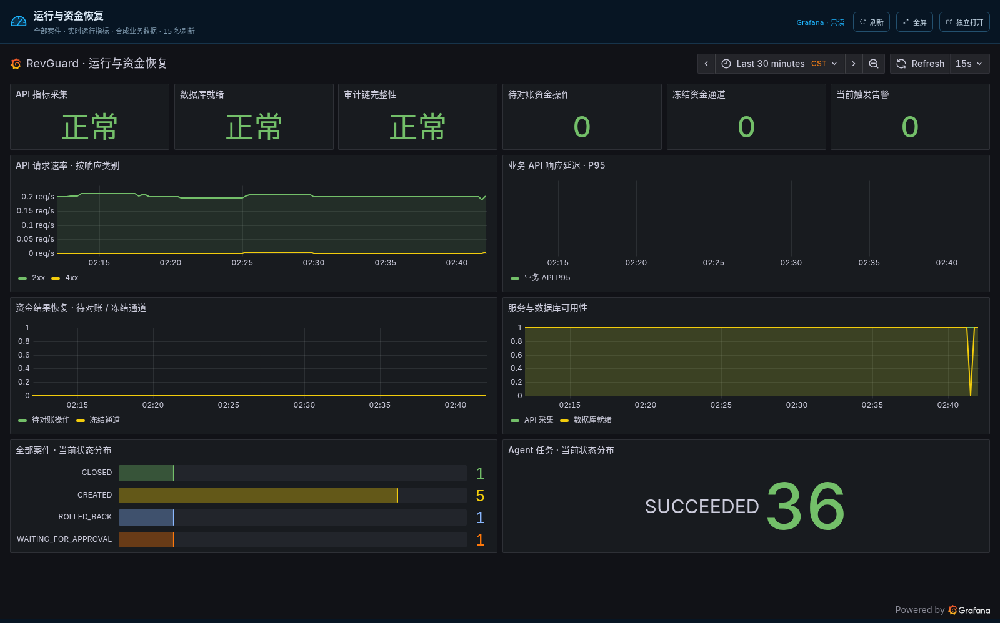

# 运行与资金恢复边界验收（2026-09-12）

RevGuard 0.5.3 已部署至 10.10.10.202 Docker。[demo-ui Grafana 大屏](http://10.10.10.202:19000/demo/?view=observability) 保持可用。本轮所有构建、测试、浏览器和故障注入在 202 容器内执行，本机仅编辑、同步、文件检查与 Git 操作。

| 发现与修复 | 验证 |
| --- | --- |
| HTTP Skill 缺少任务 ID 时可以绕过 StageTask 快照 | 原实现复现 HTTP 200；改为必填任务头，缺少返回 422 且无执行副作用，合法任务、身份与契约测试通过 |
| `RESULT_UNKNOWN` 被 StageResult 存储拒绝，任务遗留为 RUNNING | SQLite 与 PostgreSQL 同合同测试证明未知结果回执持久化；直接执行与重派均拒绝 |
| 演示重置与请求/后台任务之间没有互斥 | 共享/独占运行锁覆盖 HTTP、MCP Skill 及后台生命周期；重置中拒绝新请求，任务取消释放锁，活动/未决主库记录仍拒绝清理 |
| 清空数据库和重新播种不属于同一事务 | 完整读取 fixtures 后，在同一事务清空并播种；第二条播种失败时，原案件和审计全部保留，两种数据库均验证 |
| 恢复能力续签失败前先变为 EXECUTING | 续签成功后才离开恢复状态；失败返回 409，原案件状态保持，可以立即重试 |

`regressions-before.log` / `regressions-after.log` 保留前两项的失败复现及修复验证。完整发布检查见 `release-gate.log`：主套件发现 211 项，179 项通过；暂缓的 32 项 PostgreSQL 合同随后全部通过，合计 211 项，覆盖率显示 90%。确定性评测 105/105，Ruff、生成契约一致性、Python 依赖审计和 Bandit 通过。前端 12 项测试及 npm 审计通过；前端源码未在本轮更改，发布镜像中的页面重新构建。

`image-scan.json` 使用 Trivy 扫描 Debian/Python 发布镜像，开启 `--ignore-unfixed`，可修复 HIGH/CRITICAL 为 0。`production-image-id.txt` 与扫描报告的 ImageID 一致。该结论不代表所有严重级别、宿主机或其他服务镜像均已扫描。

部署前后，原 8 个案件、每案执行记录、9 条 ledger 和 261 行有效审计链的哈希完全一致。生产浏览器验证 12 个不同 Grafana 面板查询均为 HTTP 200，无严重控制台错误与失败请求，全屏及 390 像素宽度检查通过；4 个 Prometheus 目标全部 up。截图中部署窗口的短暂可用性变化保留真实采集结果；无业务流量的时间段不会补造 P95。

`browser-probe.py`、`health-probe.py` 为复验脚本；`source-sha256.json` 固定本次源文件，`SHA256SUMS` 覆盖证据包。业务数据仍为合成数据，监控来自实际采集。生产只更新 API 容器，未重置案件或对生产组件注入故障。

运行锁协调应用入口，不约束直接管理员 SQL 或独立 seed CLI，也不能替代 HA 隔离与资金 journal。单案重新准备涉及文件与数据库的失败原子性、完整冷部署、其他业务 UI 和比赛材料核对仍列在整项目审查清单中；`acceptance.json` 明确标记整项目复核尚未完成。

