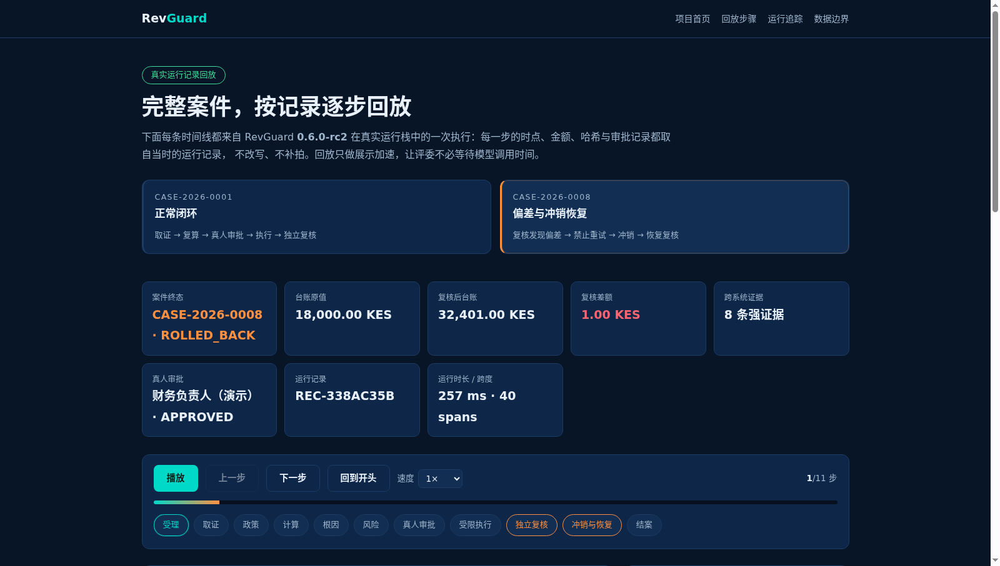

# 官网运行回放页验收（2026-09-18）

[GitHub Pages 运行回放页](https://ld0574.github.io/revguard/replay.html) 按真实运行记录回放 RevGuard 的案件，评委不需要等待模型调用时间。本次构建、静态预览与 Chromium 浏览器检查全部在 10.10.10.202 Docker 内执行；本地只编辑文件、同步与 Git 操作。

## 页面结构

回放页不再把案件清单写死在 HTML 里：页面先读 `website/data/index.json`，按索引渲染案件标签，再按标签的 `file` 字段加载对应数据包。

- `index.json` 是唯一入口，列出已发布的案件、终态、订单号、步骤数、跨度数与标签文案；
- 每个案件一个 `case-<id>.json`，由导出脚本对真实运行栈生成；
- 请求的案件不在索引里时，页面给出提示并回落到已发布的运行记录，不会出现空白页。

## 回放数据的来源

回放数据由候选版本对真实运行栈导出，不是手写素材：

```bash
docker cp scripts/export_case_replay.py revguard-api-dev:/app/data/outputs/export_case_replay.py
docker exec revguard-api-dev python /app/data/outputs/export_case_replay.py \
  --base-url http://127.0.0.1:9000 --api-key <viewer-key> \
  --case CASE-2026-0001 --case CASE-2026-0008 --output-dir /app/data/outputs/replay
```

| 案件 | 终态 | 订单 | 本次运行跨度 | 本次运行审计事件 | 页面步骤 |
| --- | --- | --- | --- | --- | --- |
| CASE-2026-0001 | CLOSED | EZ202608001 | 35 | 88（序号 353–440） | 10 |
| CASE-2026-0008 | ROLLED_BACK | EZ202608008 | 40 | 99（序号 123–221） | 11 |

导出脚本以本次运行 Trace 的最早跨度作为时间线下界，只保留该时刻之后的审计事件，避免把同一案件不同排练代次拼成一条时间线。每个数据包都带 `provenance.snapshot_sha256`（原始快照摘要）与 `audit.chain_ok`（哈希链连续性校验）。

导出可复现：对同一运行重复导出，除 `generated_at` 外与已发布数据包逐字节一致（本次用 rc3 传输验证案件复跑校验）。

## 验收结果

浏览器检查在独立 Nginx 容器提供的 `/revguard/` 子路径下执行（与 GitHub Pages 项目站点的相对路径加载方式一致），检查项直接读 `index.json`，逐个切换索引里的案件，核对摘要卡片数、阶段数、步骤数与追踪表行数。

| 检查 | 结果 | 证据 |
| --- | --- | --- |
| 首页入口 | 首页含 `replay.html` 入口，静态资源 200 | site-home.png |
| 标签与索引一致 | 页面标签数 = `index.json` 案件数（2） | browser-result.json |
| CASE-2026-0001 渲染 | 摘要 8 项、阶段 10 个、步骤 10 步、追踪 35 行 | replay-case-2026-0001.png |
| CASE-2026-0008 渲染 | 摘要 8 项、阶段 11 个、步骤 11 步、追踪 40 行 | replay-case-2026-0008.png |
| 播放交互 | 播放 9 秒推进到第 3 步，按钮为“暂停” | replay-playing.png |
| 移动端 | 390×844 无横向溢出 | replay-mobile.png |
| 资源完整性 | 无 4xx/5xx 请求、无浏览器 SEVERE 日志 | browser-result.json |

`replay-case-82822305.png` 是 rc3 传输验证案件（只读运行，无资金写入）在同一套预览栈下的渲染结果，用于确认 rc3 数据包也能被页面正确加载。

部署完成后对公网站点 `https://ld0574.github.io/revguard/` 复跑同一套检查，8 项全绿，结果保存在 [`public/browser-result.json`](public/browser-result.json)。

## 数据代次

当前 `index.json` 发布的是 rc2 代次的两条完整运行记录（含真人审批、受限执行、独立复核与冲销恢复）。rc3 代次的决赛运行记录在录制栈上重新跑通后会替换 `index.json` 的条目，届时案件编号、Step 数与审计序号都会更新。旧的 rc2 截图归档在 [`archive-rc2/`](archive-rc2/) 下。

## 边界

回放节奏是展示加速，动画间隔不代表真实执行耗时；页面上的时点、金额、哈希与审批记录为记录原值。导出的数据包已移除凭据、内部地址、Matrix 用户与房间标识，审批人只保留角色与展示名。业务样本为合成数据，ERPNext、PostgreSQL 与监控组件为真实运行系统。


