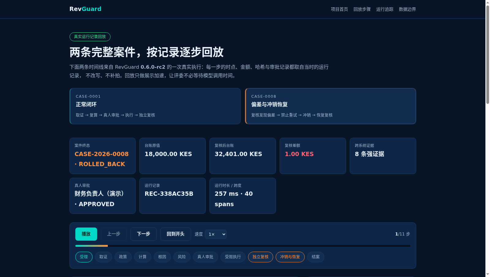

# 官网运行回放页验收（2026-09-18）

[GitHub Pages 运行回放页](https://ld0574.github.io/revguard/replay.html) 按真实运行记录回放 CASE-0001 与 CASE-0008，评委不需要等待模型调用时间。本次构建、静态预览与 Chromium 浏览器检查全部在 10.10.10.202 Docker 内执行；本地只编辑文件、同步与 Git 操作。

## 回放数据的来源

回放数据由候选版本对真实运行栈导出，不是手写素材：

```bash
docker run --rm --user 0:0 --network revguard-dev_default \
  -v /root/revguard-0.6.0-dev/scripts/export_case_replay.py:/app/export_case_replay.py:ro \
  -v /root/rgops/replay-out:/out --entrypoint python revguard-api:0.6.0-rc2 \
  /app/export_case_replay.py --base-url http://revguard-api-dev:9000 \
  --api-key <viewer-key> --output-dir /out
```

| 案件 | 终态 | 记录编号 | 本次运行跨度 | 本次运行审计事件 | 页面步骤 |
| --- | --- | --- | --- | --- | --- |
| CASE-2026-0001 | CLOSED | REC-FD21783C | 35 | 88（序号 353–440） | 10 |
| CASE-2026-0008 | ROLLED_BACK | REC-338AC35B | 40 | 99（序号 123–221） | 11 |

导出脚本以本次运行 Trace 的最早跨度作为时间线下界，只保留该时刻之后的审计事件，避免把同一案件不同排练代次拼成一条时间线。每个数据包都带 `provenance.snapshot_sha256`（原始快照摘要）与 `audit.chain_ok`（哈希链连续性校验）。

## 验收结果

| 检查 | 结果 | 证据 |
| --- | --- | --- |
| 首页入口 | 首页含 `replay.html` 入口，静态资源 200 | browser-result.json |
| 主案例渲染 | CASE-0001 摘要 8 项、阶段 10 个、步骤 10 步 | replay-case-0001.png |
| 运行追踪 | 追踪表 35 行，与记录跨度数量一致 | browser-result.json |
| 副案例切换 | 切换到 CASE-0008 后阶段 11 个 | replay-case-0008.png |
| 播放交互 | 播放 9 秒推进到第 3 步，按钮为“暂停”（回放进行中）且无报错 | browser-result.json |
| 移动端 | 390×844 无横向溢出，页头改为两行不遮挡 | replay-mobile.png |
| 资源完整性 | 无 4xx/5xx 请求、无浏览器 SEVERE 日志 | browser-result.json |

浏览器检查先在独立 Nginx 容器提供的 `/revguard/` 子路径下执行（与 GitHub Pages 项目站点的相对路径加载方式一致），随后对公网站点 `https://ld0574.github.io/revguard/` 复跑同一套检查，公网结果同样 8 项全绿（见 `public/browser-result.json`）。

## 边界

回放节奏是展示加速，动画间隔不代表真实执行耗时；页面上的时点、金额、哈希与审批记录为记录原值。导出的数据包已移除凭据、内部地址、Matrix 用户与房间标识，审批人只保留角色与展示名。业务样本为合成数据，ERPNext、PostgreSQL 与监控组件为真实运行系统。


