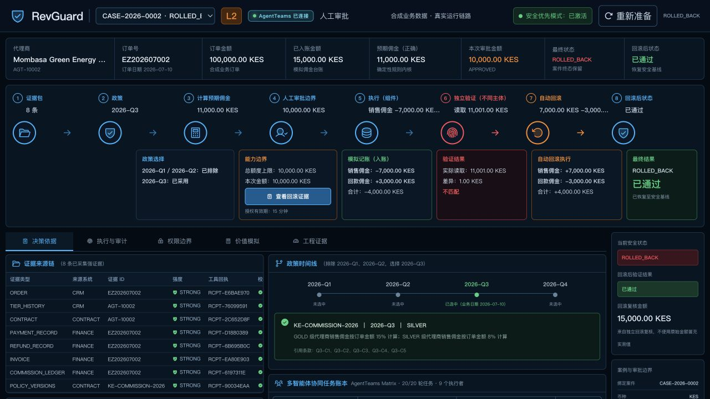
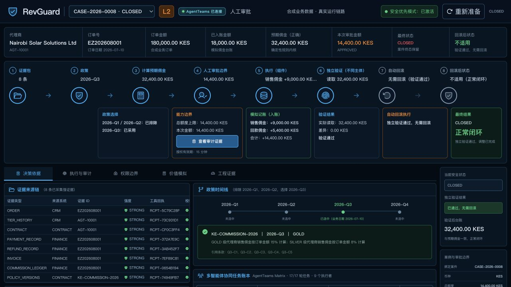
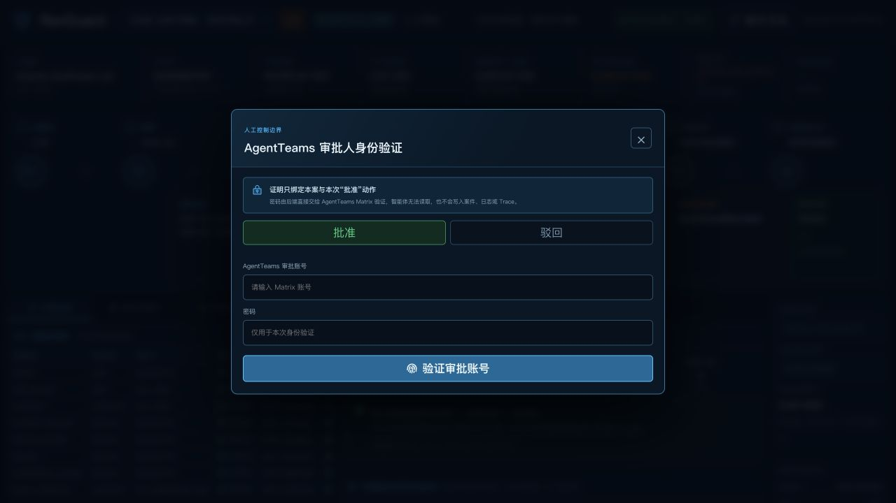
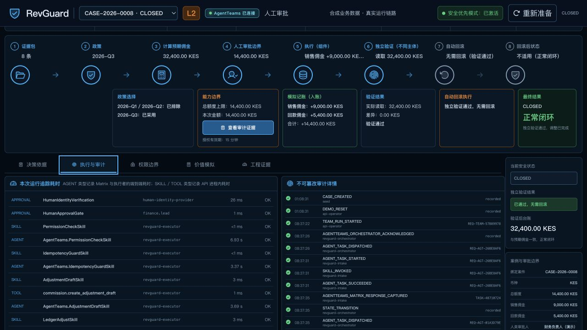
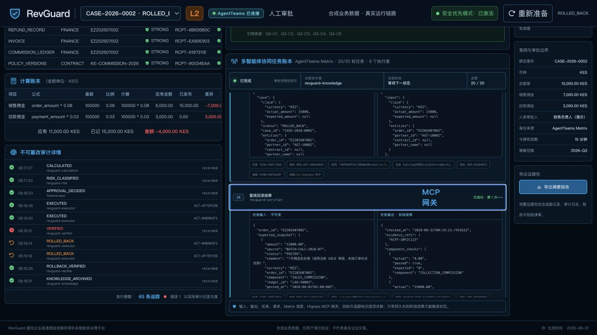
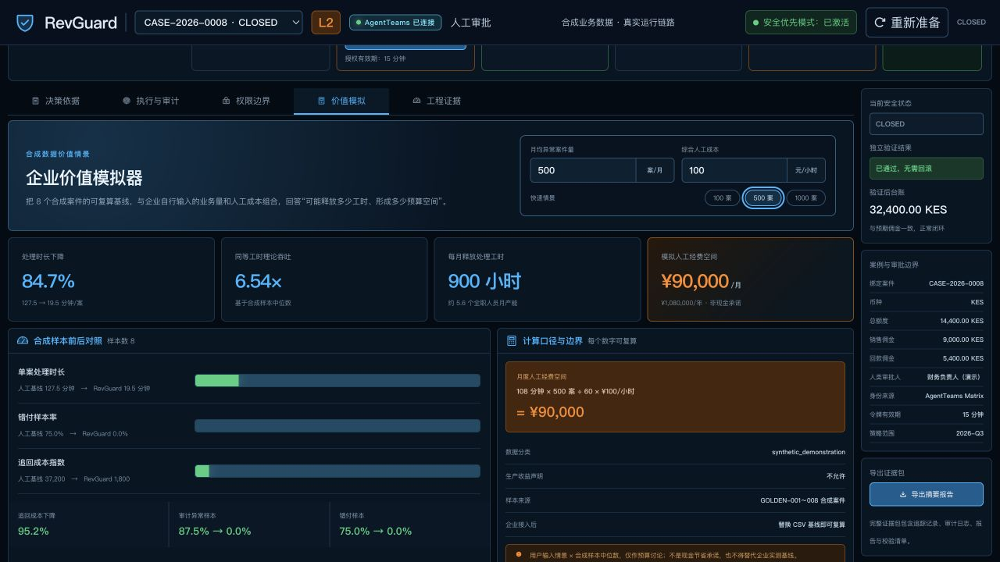
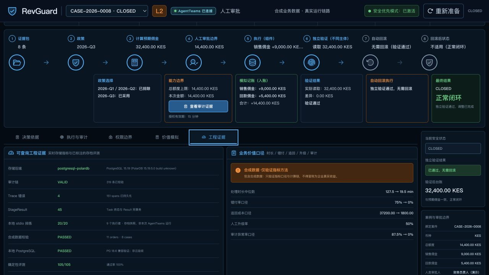
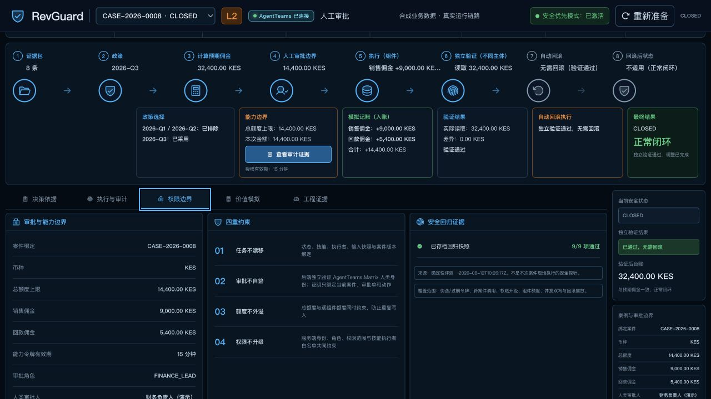

# WebUI 录制画面对齐检查（2026-08-31）

结论：当前环境可录正常闭环与故障回滚素材；请使用
[当前数据版完整脚本](demo-script-current-data.md)。已完成案件标注“运行记录回看”，
人审镜头另用明确标识的合成案件现场操作，不混成同一笔业务。

## 1. 故障回滚主画面 — 通过

CASE-2026-0002 已为 ROLLED_BACK，任务 20/20，非 EXECUTING。
截图中销售佣金 -7,000、回款佣金 +3,000、净额 -4,000 均可见；对应冲销为 +7,000/-3,000。
首次验证差 1 KES，回滚复核恢复 15,000。右栏实测值来自复核证据，不是硬编码恢复金额。

## 2. 正常闭环主画面 — 通过

CASE-2026-0008 为 CLOSED，任务 17/17，验证 32,400、差异 0。
自动回滚卡明确“无需回滚”，末卡与右栏不再显示等待回滚；不能配 0008 失败回滚的旧旁白。

## 3. 人审入口与动作选择 — 界面通过，真人实录待组员完成

新增 CASE-226175B6（QA_REHEARSAL），真实完成 8 轮调查，等待审批 6,600 KES。
打开、切换批准/驳回及退出弹窗可用；选择变化同步显示在动作绑定说明。
最终文案为“验证审批账号”，不把密码验证说成真人在场证明。
本轮浏览器未输入任何账号密码，也未提交批准，后端仍为 PENDING、0 笔执行。
后端认证/审批端到端自动测试与这张待验证截图是不同证据，不混报为浏览器实录通过。

## 4. 协作与审计 — 数据和入口通过

多智能体任务账本在“决策依据”右侧；输入、输出、MCP 网关及关联 ID 可展开。
“执行与审计”显示 AGENT 秒级耗时与本地 Skill/Tool 耗时，不再把 0/1 ms 误解为模型响应耗时。
审计也保留在“决策依据”计算账本下。两份脚本的操作入口已改正。

## 5. 价值模拟 — 数字与交互通过

默认 500 案、100 元/小时，显示 900 小时与 90,000 元/月。实点 1000 案后变为 1,800 小时、
180,000 元/月，再恢复 500；不是固定写死的结果。画面包含公式、样本来源及禁止宣称生产收益的边界。

## 6. 工程证据来源 — 已纠正

存档本地 stdio 排练、确定性评测与当前存储指标分开；灰度模板不再被描述为已执行灰度。
AgentTeams 通信配置标注“已配置（非在线探测）”，不凭配置字段声称所有房间现场验收通过。
本机开源 PolarDB、云端验收和企业真实基线分别列出，未知状态不默认通过。

## 7. 权限与安全回归 — 已纠正

审批额度与案件绑定可读；原固定六项“已拒绝”改成读取评测文件的安全回归 9/9，
标明存档时间和“不是本次案件现场安全探针”。现场角色隔离应使用单独的网关实测证据。

## 录制和可访问性风险

- 截图是本轮专用浏览器的真实 1280×720 视口，没有采集其他私人标签页。
  表格、JSON 和辅助说明偏小；录制时先检查原片，细节镜头放大，不把整页缩小塞入一镜。
- 1920×1080 DOM 检查为 `clientWidth=scrollWidth=1920`，但该浏览器工具的大视口截图
  出现裁切和拼接异常；这些异常图已排除，未作为通过证据。最终 1080p 原片由组员录屏软件确认。
- 按钮可见焦点边框，状态有文字说明而不只靠颜色；本轮未完整验证键盘焦点循环、读屏器、
  对比度或低视力场景，不宣称无障碍合规。
- 正式本人审批与 Matrix 房间镜头由组员录制；不要向视频展示密码、原始令牌或无关会话。
- 当前页面和账号映射只用于内网演示，企业 SSO/MFA、实名审批治理、HTTPS/限流、
  生产资金接入与云高可用/PITR 仍须另行验收。
- **完整 HITL 文档对齐尚有身份归属门槛**：共享演示 admin 的验证不等于具体自然人归因。
  已请求组员提供个人 Matrix 用户 ID（不索取密码），待确认身份映射后绑定白名单；
  独立 Matrix 账号仍不等同于已实现企业 OIDC/SSO 或 MFA，不将这几项混报为完成。

技术回归与现场运行明细见 [部署与录制验收](runtime-acceptance-2026-08-31.md)。
